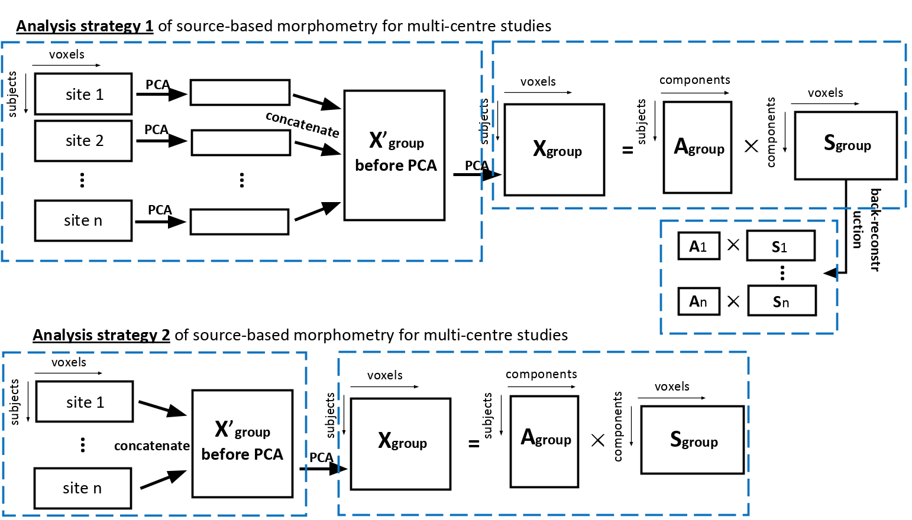

# MRI Independent Component Analysis

This project belongs to the [UBC NINET Lab](https://ninet.med.ubc.ca/).
This is a private repository. 

## Project Description

We want to demonstrate that our analyais strategy (strategy 1) outperforms the conventional one (strategy 2) for T1-weighted MRI Data. 

## Application 

Neuroimaging research is a collaborative effort, collaborative networks of researchers working together on a range of large-scale studies have been initiated.

A prominent issue with a multicentre study is the heterogeneity of the data from scanners with different manufacturers (Siemens, GE, Philips…) and field strength (1.5T, 3T…).

## Deadline

Paper draft by end of August
